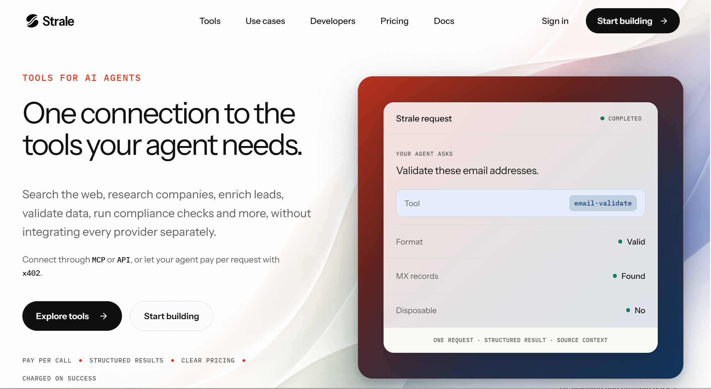
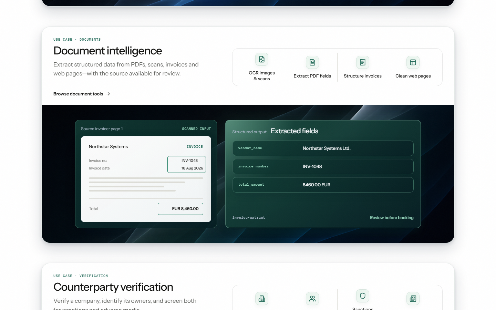
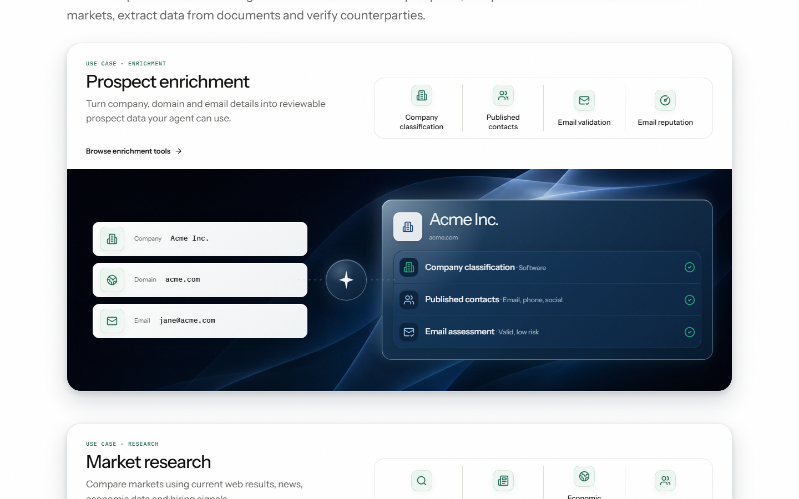

# The original redesign is the visual baseline

Current continuation reference, 6 September 2026. The founder rejected the subsequent homepage composition as boring and too far from the unfinished redesign, then authorised returning to the original and assessing it against the refined kit. This corrects the review target; it does not reopen positioning, the logo, accepted fonts or companion acceptance.

## Start with this image

This is the exact founder attachment, preserved without editing. It is the controlling visual reference: broad folded atmosphere, large quiet typography, black actions and a substantial Spectrum-framed product example. Its historical copy, completed badge and commercial statements are not newly approved claims.

The preserved Quiet Material v0.7 release is the editable source reference for the later unfinished site. It is not the exact screenshot revision. Its checksum and release location are in [the source registry](registry.json); the [earlier rendered review](../../../../archive/sessions/2026-09-05-quiet-material-review.md) records which routes were inspected. Only the original hero is known for the exact founder screenshot revision. Do not invent its unseen sections.

## What went wrong in the later study

The [set-aside composition](../homepage/output/homepage-desktop.png) isolated atmosphere inside a small rounded rectangle, removed the prominent coloured frame, replaced detailed demonstrations with a plain diagram/list sequence and made white space the dominant visual feature. Those were substantial art-direction changes, not merely improvements to density. Technical verification did not establish fidelity or visual quality.

The original and that experiment contain different copy and examples. Their comparison establishes direction drift; it is not a controlled before-and-after test of spacing or conversion.

## Apply the kit to the existing design

| Element | Keep from the original | Focused correction or test | Kit source / boundary |
|---|---|---|---|
| Opening atmosphere | Folds extend across the composition, including its quiet left area; artwork has room to be felt. | Preserve placement and visual reach. Check text over the actual crop at each width; do not confine the atmosphere to an illustration thumbnail. | [Atmosphere guide](../README.md), registered opening master. Raster text contrast remains a rendered-context check. |
| Hero product example | Large Spectrum field on the right, with a recognisable result inside. | Test a less heavy frame and solid reading surface while preserving the outer footprint. Do not blindly apply the catalogue's small specimen inset to a hero. | [Atmosphere rules](../registry.json); specimen geometry is not page geometry. |
| Nested reading surfaces | One clear surface for detailed fields. | Remove additional same-tone layers. Keep a deliberate visible frame; do not make every container a card. | Accepted light reading panel recipe for dark fields. |
| Dark marketing sections | Strong dark colour moments remain part of the page. | Short benefit copy may sit directly on approved Cobalt/Dusk with a light action. Detailed results still need their own reading surface. | [Foundations](../foundations/README.md); direct-text permission does not extend automatically to all rasters or gradients. |
| Frost and Mint | A quieter light composition can provide a change of pace. | Use dark text directly; do not force a dark inner card merely to invert the theme. | Accepted atmosphere pairings. |
| Typography and actions | Large headline, generous scale difference, confident black pill actions. | Apply accepted type roles and control states at the original visual scale. Avoid shrinking everything into document-specimen proportions. | [Foundations](../foundations/README.md), [controls](../controls/README.md). |
| Information density | One recognisable product task and a strong main message. | Separate protocol details and commercial microcopy from the opening's main reading path. Remove repeated explanation before removing visual character. | [Patterns](../patterns/README.md), adopted positioning and claim rules. |
| Symbols | Functional cues in the demonstration. | Replace repeated generic category strips only where they duplicate the section text. Do not make every heading carry an icon. | Accepted utility masters; no new logo or symbol family. |
| Page rhythm | Large atmospheric demonstrations are valuable anchor sections. | Keep the strongest anchors; vary the intervening sections and their relative length. Do not convert the whole page into an open list and dividers. | Later site's documented section evidence, not an invented full layout for the screenshot revision. |
| Motion | The sense of flowing material can remain without constant movement. | Inspect the original interactions separately; this still-image review makes no judgment about motion quality. | Reduced-motion rules remain applicable; no autoplay/video addition is implied. |

## Two concrete contexts in the later unfinished site

The document-to-fields transformation is worth keeping at this scale. The stacked green surfaces and repeated header labels add clutter. A focused revision should preserve the dark folded stage and two-object relationship, then simplify the reading surfaces. The source/output company names currently differ; any future illustrative fixture must be internally faithful. This is historical design evidence, not a verified tool response.

The blue atmosphere, large result object and visible input-to-output relationship supply character. Three input cards, a central decorative symbol, an outer result card and its inner card create competing layers. Keep the spatial relationship; reduce the layers and redundant icon strip. Do not replace the entire demonstration with three text links.

## Current controlled comparison

The [first paired study](../hero-comparison/index.html) is now available. It reconstructs the supplied hero for a same-content frame/surface comparison; it does not replace this exact screenshot as the reference or establish an original mobile revision. B remains proposed.

### Comparison scope

Refine the opening in the original composition. Keep the same headline, example task, navigation, outer illustration footprint and atmospheric placement for the first comparison; label the example illustrative in both versions. Change only frame/reading-surface treatment and its spacing. Show original and revision at matching desktop and narrow sizes. Follow with a separate copy-density pass so its effect can be judged independently. Do not rebuild the rest of the homepage first.

Acceptance questions are concrete: is the original immediately recognisable; does the frame feel lighter without losing presence; are the important result fields easier to read; does the narrow layout preserve both atmosphere and legibility? A clean browser result is necessary implementation evidence, not an affirmative answer to these design questions.

The shared-access illustration and four accepted companions remain available design inputs. Their acceptance does not make the rejected page arrangement a default. No new production token values or public claims are adopted here.
