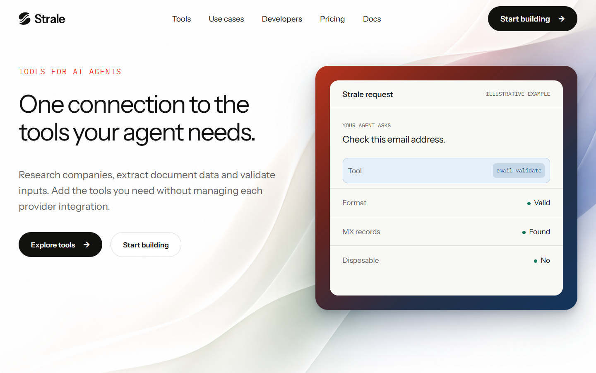
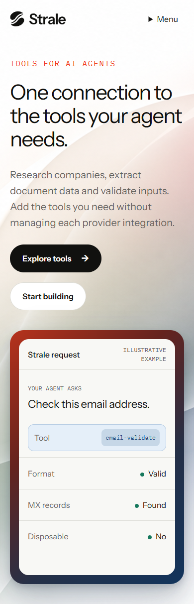

# Shorter copy within B

**Set aside as an editorial direction following founder feedback on 6 September.** B's styling remains selected; this copy is not accepted. Continue from the [narrative handoff](../../../../handoff/_general/from-code/2026-09-06-brand-narrative-reset.md). The snapshots and specification below remain unchanged as historical evidence.

**Draft copy for review.** B's visual treatment is selected; this wording is proposed. The [copy specification](../../../../docs/programs/brand-website/HERO-COPY.md) owns the text and its scope. The [original B](../hero-comparison/refined.html) remains unchanged for comparison.

## Desktop

## Mobile

These are static editorial snapshots, not a new interactive page. Assess whether the message and next action are easier to find while the retained atmosphere and example keep their presence.

## Reproduction and limits

Source: `../hero-comparison/refined.html` and its unchanged styles/assets, introduced by PR #606 at `bd4590a6f618b9aadd513bf15b5577e986f43a79`. In Chromium with reduced motion and local assets loaded, replace `.lead` and `.request p` with the exact `supporting` and `example_request` front-matter values in HERO-COPY.md. Remove `.protocol`, `.commercial` and the two navigation links whose text is `Sign in`. Empty the `.request-footer` text, retaining its layout slot so the original panel footprint does not change. No CSS, font, image or token values change. Capture full pages at 1440 × 900 and 390 × 900 viewports.

The empty former footer space is deliberate in this copy-only comparison; final illustration spacing remains an implementation refinement. Automated measurements check no horizontal page overflow and unchanged stage dimensions. Parent visual inspection checks readable text and no visible collisions at these two sizes. This is not an assertion of complete accessibility, interactive destination coverage, or product qualification. The illustrative data remains unchanged.
